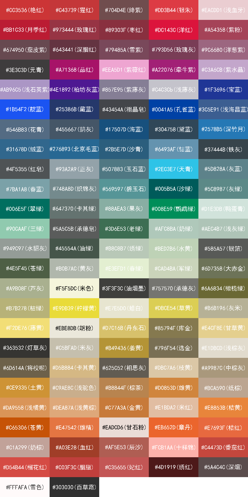

# cncolor

The Chinese Color List.

## Features

  - Contains most Chinese colors.
  - Use sass or less variabel in your project.
  - Very simple.

## Contributing

  - Fork it!
  - Create your feature branch:`git checkout -b your-feature`.
  - Commit your changes:`git commit -am 'Add some information'`.
  - Push to the branch: `git push origin your-feature`.
  - Create new Pull Request.
  
## Show

## License

  cncolor &copy; [qingzhan](https://github.com/mintsweet), Released under the [MIT](./LICENSE) License.